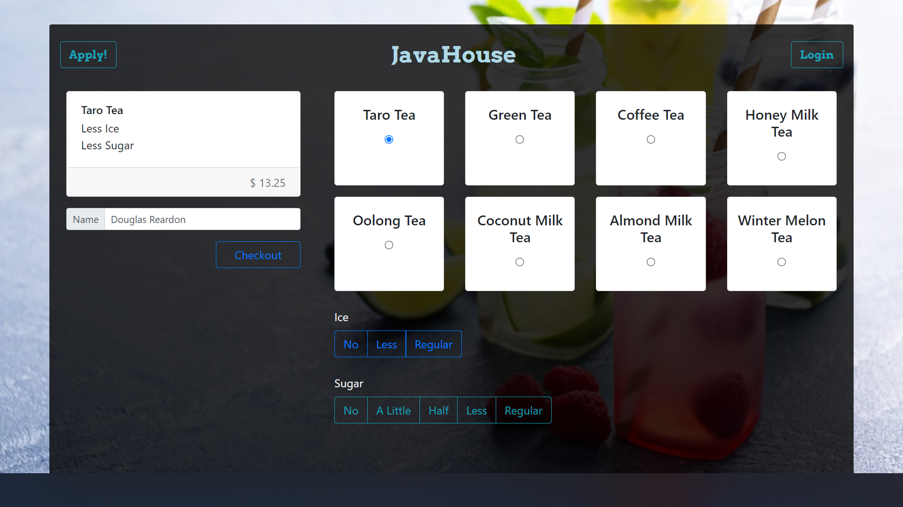

# JavaHouse
### Full Stack Application built using EJS, CSS, JavaScript, Node, Express & MongoDB.
JavaHouse is a Full-Stack application that allows a user to place an order for a drink on a POS & sign up as a barista to complete submitted orders to check them off.

